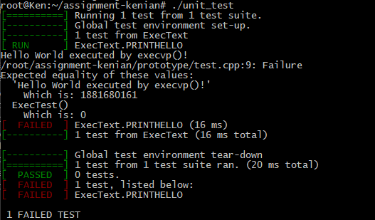

# CS 100 Programming Project

## Project Information

This Project is done by Shuang Zhou (SID: 862137762) and Chenyue lin (SID: 862142104) in Winter 2020.

## Introduction

This Project is to develop a command shell in C++. We will call it R'Shell (or rshell for short). This program is able to peforming printing a command prompt, read input from the user, execute appropriate commands, work with the connectors && || ; and repeat until an exit command is executed.

## Diagram

## Classes

1. RShellBase: The base of executable. It contains the basic sturcture and inheritance execute command.

   - RShellExec
   - RShellConn

2. RShellExec: Read the input command and execute the appropriate command.

   - RExit

3. RShellConn: Read the input from user, determine the connector and execute appropriate Connector.

   - RAnd
   - ROr
   - RSeparator

4. RExit: A simple class that exit the command line.
5. RAnd: A simple class that execute AND command.
6. ROr: A simple class that execute OR command.
7. RSeparator: A class that Separate the command from left and right.

## Prototypes

We tried to create a prototype using `fork()`, `waitpid()`, `execvp()` and tried using google test to test the prototype. We created a helloworld program for the prototype to work with. After initiate the prototype program, the google test return failed but with interesting results (Below is the what was shown). We received some explanation about our ExecTest function. Since we can't compare a pointer to a string (the compiler won't allow us to do so), we can't really make the googletest passed. In addition, We added main function into the ExecTest, and it is working as intended(which execute our helloworld). We also added a statement right after our `waitpid()` to further prove it showed that we are waiting for our child process to execute, then we execute our parent process.

Since we added a main function into our ExecTest, the google test unfortunately can't work, so if we want to make google test work, we need to remove the main function in ExecTest.

## Development and Testing Roadmap

The Development Roadmap will start at the following steps

1. Build a command base <https://github.com/cs100/assignment-kenian/issues/1>
2. Read user input <https://github.com/cs100/assignment-kenian/issues/2>
3. Print error message for invalid input <https://github.com/cs100/assignment-kenian/issues/3>
4. Execute Appropriate commands <https://github.com/cs100/assignment-kenian/issues/4>
5. Test for the # symbol which is comment don't execute it <https://github.com/cs100/assignment-kenian/issues/5>
6. Test for && connector <https://github.com/cs100/assignment-kenian/issues/6>
7. Test for || connector <https://github.com/cs100/assignment-kenian/issues/7>
8. Test for ; connector <https://github.com/cs100/assignment-kenian/issues/8>
