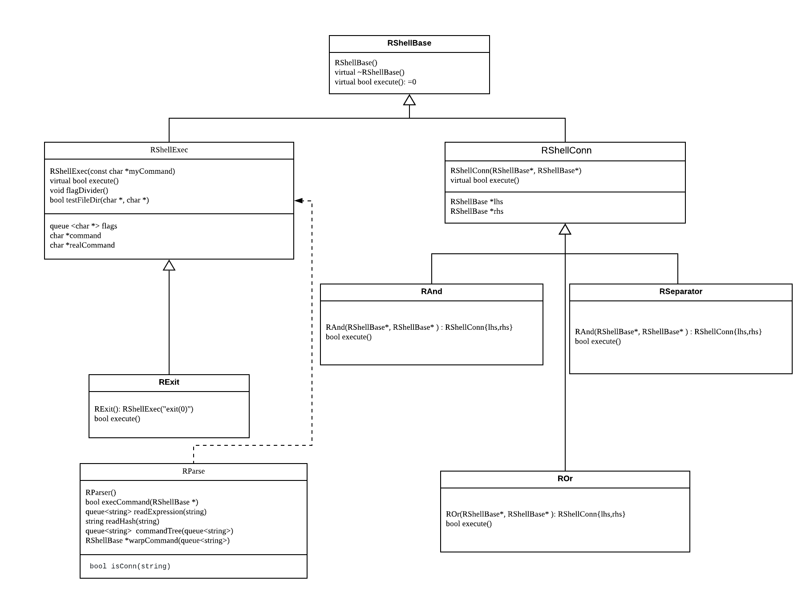

# CS 100 Programming Project

## Project Information

This Project is done by Shuang Zhou (SID: 862137762) and Chenyue lin (SID: 862142104) in Winter 2020.

## Introduction

This Project is to develop a command shell in C++. We will call it R'Shell (or rshell for short). This program is able to peforming printing a command prompt, read input from the user, execute appropriate commands, work with the connectors && || ; and repeat until an exit command is executed.

## Diagram

## Classes

1. RShellBase: The base of executable. It contains the basic sturcture and inheritance execute command.

   - RShellExec
   - RShellConn

2. RShellExec: Read the input command and execute the appropriate command.

   - RExit

3. RShellConn: Read the input from user, determine the connector and execute appropriate Connector.

   - RAnd
   - ROr
   - RSeparator

4. RExit: A simple class that exit the command line.
5. RAnd: A simple class that execute AND command.
6. ROr: A simple class that execute OR command.
7. RSeparator: A class that Separate the command from left and right.

## Prototypes

## Development and Testing Roadmap

The Development Roadmap will start at the following steps

1. Build a command base
2. Read user input
3. Print error message for invalid input 
4. Execute Appropriate commands
5. Test for the # symbol which is comment don't execute it
6. Test for && connector
7. Test for || connector
8. Test for ; connector
 
